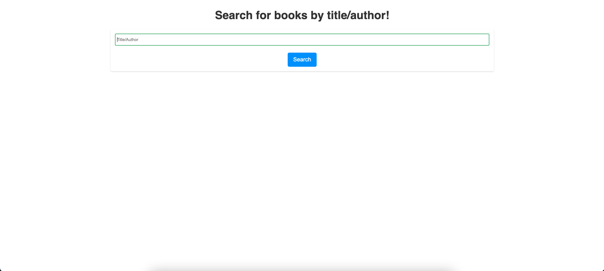
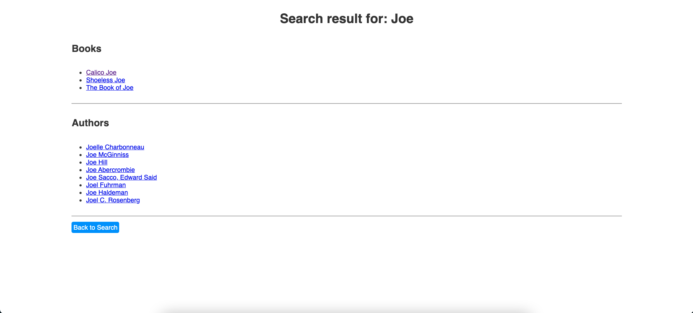
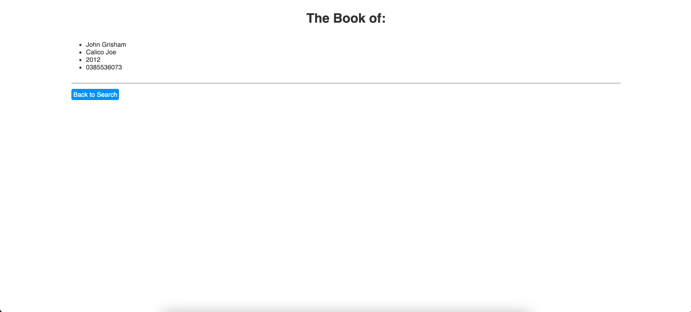

# Books

A simple Flask, Flask Sqlalchemy, Postgres and Heroku app.
It imports all of the books and authors into the database from csv file.

## Environment Variables:

`export DATABASE_URL=[postgres heroku addon database url]`

## Models

```
class Book(db.Model):
    __tablename__ = "books"
    id = db.Column(db.Integer, primary_key=True)
    isbn = db.Column(db.String, nullable=False)
    title = db.Column(db.String, nullable=False)
    year = db.Column(db.Integer, nullable=False)
    author_id = db.Column(db.Integer, db.ForeignKey("authors.id"), nullable=True)

class Author(db.Model):
    __tablename__ = "authors"
    id = db.Column(db.Integer, primary_key=True)
    name = db.Column(db.String, nullable=False)
    books = db.relationship("Book", backref="book", lazy=True)
    db.UniqueConstraint(name)
```

### Home page (search books)



### Search Results Page



### Book Detail Page


